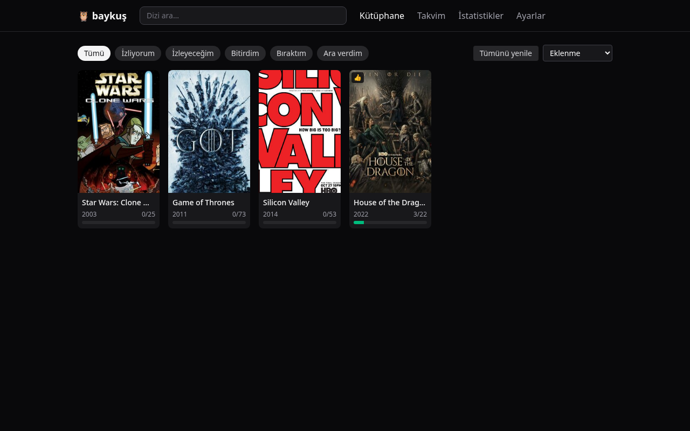
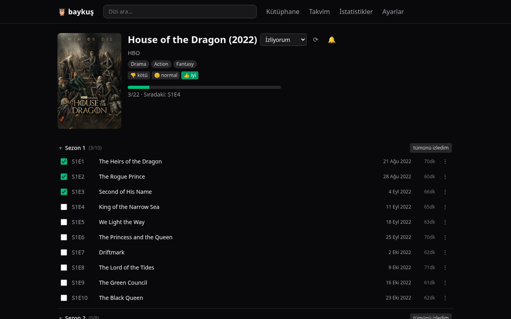
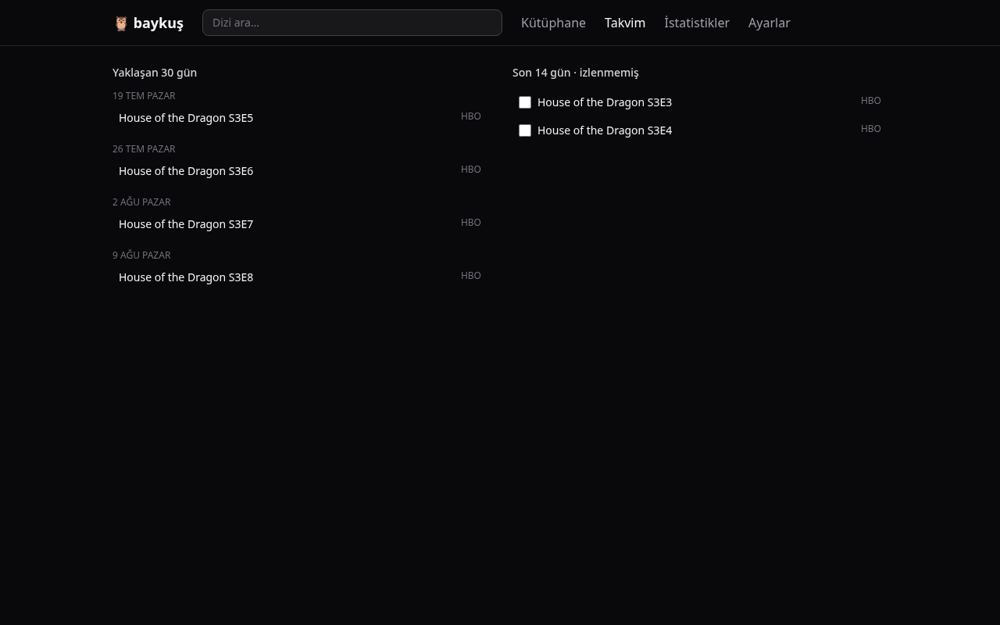

# baykuş 🦉

Dizi (ve ileride film + kitap) takip uygulaması. TV Time / Serializd benzeri, ama:

- **Self-hosted önce**: Tek bir Docker container ile kendi sunucunda çalışır.
- **Hosted da var**: [baykus.xava.me](https://baykus.xava.me) üzerinde herkes bir handle claim edip kendi kütüphanesini tutabilir.
- **Verin senindir**: Tüm kütüphane (izleme geçmişi, puanlar, gelecek bölümler, platform bilgileri) tek bir zip dosyası olarak indirilebilir/yüklenebilir. Görseller hariç — onlar tekrar indirilebilir önbellektir.
- **Tamamen modüler**: Metadata sağlayıcıları (TMDB, TVmaze, IMDb, Serializd) bağımsız kütüphaneler olarak `packages/` altında yaşar ve çekirdek uygulama hiçbirine doğrudan bağımlı değildir.

## Özellikler (v1 — dizi modülü)

- Dizi arama ve kütüphaneye ekleme (TMDB birincil, TVmaze anahtar gerektirmeyen fallback)
- Bölüm bazında izleme takibi: izleme tarihi, tekrar izleme (rewatch), sezon/dizi toplu işaretleme
- Dinamik kategoriler (otomatik hesaplanır, arka plan işi yok): izleniyor, bir süredir izlenmedi,
  daha başlanmadı, güncel, bitirildi — artı iki manuel liste (sonra izlenecek, bırakıldı) kullanıcı
  tarafından ayarlanabilir ve bir bölüm izlenince otomatik temizlenir. İzleniyor sadece izlemeye
  değil gerçek aktiviteye tepki verir: bir bölüm izlersin, uzun süre ara verdiğin bir dizinin yeni
  bölümü çıkar, ya da arama çubuğundan yeni bir dizi eklersin (import'lar hariç) — üçü de diziyi
  İzleniyor'a taşır; sessiz kalan pencere (varsayılan 30 gün, ayarlardan değiştirilebilir) sonunda
  geri düşer
- Sezon-segmentli ilerleme çubuğu: izlediğin sezonlar dolu kare, üzerinde olduğun sezon mini bar,
  kalanlar boş kare (◼◼◼[▰▰▰▱▱]◻◻) — atlama yaparak izlediysen veya 12'den fazla sezon varsa eski
  düz yüzde çubuğuna döner. Sadece **yayınlanmış** bölümler sayılır: duyurulmuş ama henüz
  yayınlanmamış bölümlerin olması, güncel yakaladığın bir dizinin çubuğunu eksik göstermez
- 3'lü puanlama: **1 = kötü, 2 = normal, 3 = iyi** (dizi ve bölüm seviyesinde)
- Takvim: zaman çizelgesi (gün gün, BUGÜN'e otomatik scroll, poster görselli) ve ay görünümü
  modları, artı web push bildirimi (ayarlardan test bildirimi gönderilebilir) — ikisi de sadece
  aktif (izlenen) dizilere odaklanır
- İzleme sayfası: son 30 izlemenin geçmişi (diğer bölümlerle aynı satır görünümünde), sıradaki
  bölümler ve bir süredir izlenmeyenler bölümleri, hızlı işaretleme, sayfa açılışında sıradaki
  bölümlere otomatik scroll
- Sticky üst menü; mobilde alt sekme çubuğu (lucide-react ikonlarıyla, ikon fontu yok)
- Hangi platformda yayında bilgisi (TMDB watch providers)
- Manuel metadata güncelleme — zamanlanmış arka plan işi gerekmez, "Yenile" butonu yeter
- Zip export/import (taşınabilir, sürümlü format)
- TV Time'dan veri aktarımı (GDPR export'u): TV Time'da "izlemeyi bıraktım" dediğin diziler
  Bırakıldı listesine düşer; TV Time'da zaten takipten çıkardığın ve hiç izlemediğin "kalıntı"
  takipler sessizce ama görünür şekilde (sihirbazda bir açıklama ile) atlanır
- Provider-parity dizi adresleri: `/series/<tmdbId>` — Serializd'in kullandığı aynı TMDB
  numarasıyla açılır; henüz bir TMDB eşleşmesi olmayan diziler `/series/i<dahili id>` adresinde
  kalır ve bir "Yenile" sonrası otomatik olarak TMDB adresine geçer
- Sayfa geçişleri: kütüphane kartından dizi detayına geçişte poster yerinde akarak morph olur,
  diğer sayfa değişimlerinde hafif bir cross-fade olur; "hareketi azalt" ayarında veya View
  Transitions API'yi desteklemeyen tarayıcılarda anlık geçişe düşer
- Favoriler: dizi detayında kalp ile favorile, profilde poster rafı olarak görünür — zip
  export/import'ta korunur (güncel schemaVersion 6)
- Profil hub (`/user/handle`): favoriler rafı, özet istatistikler, tüm diziler / detaylı
  istatistikler / ayarlar linkleri, "Tümünü yenile" — kütüphane sayfası artık sadece aktif
  takip edilen 5 kategoriyi gösterir, Bitirildi/Bırakıldı profil üzerinden "Tüm diziler"e taşındı
- Otomatik yenileme: kütüphane veya dizi detayı açıldığında 24 saatten eski diziler arka planda
  sessizce yenilenir (arka plan işi değil, sadece sayfa ziyaretinde tetiklenir); manuel
  "Tümünü yenile" birincil yol olarak kalır
- Mobil arayüz: 3 sütunlu kütüphane grid'i, yüzen filtre butonu (bottom sheet), ortalanmış logo +
  "Ara" sekmesiyle 5'li alt navigasyon, kenar boşlukları daraltıldı, alt sayfalarda geri oku
- Türkçe + İngilizce arayüz

Sonraki modüller: film, kitap. Mimari en baştan çoklu medya tipine göre tasarlandı; bkz. [specs/](specs/).

## Ekran görüntüleri

| Kütüphane | Dizi detayı | Takvim |
|---|---|---|
|  |  |  |

> Bu görüntüler spec 002 (dinamik kategoriler, takvim modları, izleme
> sayfası) öncesinden kalma — güncel arayüzü tam yansıtmıyor. Otonom
> yürütmede tarayıcı erişimi olmadığı için yenilenemedi; bir sonraki
> tarayıcılı oturumda güncellenmeli.

## Mimari (özet)

```
baykus/  (pnpm monorepo — paketler npm'e yayınlanmaz, workspace olarak yaşar)
├── apps/
│   ├── web/                  # Vite + React SPA
│   └── server/               # Hono API — single (self-host) & multi (hosted) mod
├── packages/
│   ├── core/                 # Domain modeli, SQLite (Drizzle), zip export/import
│   ├── provider-sdk/         # MetadataProvider arayüzü + ortak tipler
│   ├── provider-tmdb/        # TMDB sağlayıcısı (API key gerekir)
│   ├── provider-tvmaze/      # TVmaze sağlayıcısı (anahtarsız)
│   ├── provider-imdb/        # IMDb scraper (opsiyonel, sadece puanlar)
│   ├── provider-serializd/   # Serializd scraper (opsiyonel)
│   └── importer-tvtime/      # TV Time export dönüştürücü
└── specs/                    # Spec-driven development dokümanları
```

**Tek kavram: Kütüphane (Library).** Çekirdek uygulama tek kullanıcılık bir kütüphane yönetir. Self-hosted kurulumda bir tane kütüphane vardır. baykus.xava.me'de ise her handle bir kütüphaneye eşlenir — çok kullanıcılılık çekirdeğe sızmaz, ince bir katmandır.

**Veri:** Canonical veri SQLite'tadır (hız + sorgu kolaylığı). Zip, taşınabilirlik formatıdır: içinde sürümlü JSON dosyaları bulunur ve kayıpsız round-trip garanti edilir. Görseller zip'e girmez; disk üzerindeki önbellekte tutulur ve gerektiğinde sağlayıcılardan yeniden indirilir.

## Dokümanlar

| Doküman | İçerik |
|---|---|
| [.specify/memory/constitution.md](.specify/memory/constitution.md) | Proje anayasası — değişmez ilkeler |
| [specs/001-series-tracking/spec.md](specs/001-series-tracking/spec.md) | v1 fonksiyonel spec (user story + gereksinimler) |
| [specs/001-series-tracking/plan.md](specs/001-series-tracking/plan.md) | Teknik plan (stack, modüller, API) |
| [specs/001-series-tracking/data-model.md](specs/001-series-tracking/data-model.md) | SQLite şeması + zip formatı (normatif kopya: `packages/core/src/db/schema.ts`) |
| [specs/001-series-tracking/contracts/api.md](specs/001-series-tracking/contracts/api.md) | HTTP API kontratı — endpoint başına istek/yanıt örnekleri |
| [specs/001-series-tracking/ui.md](specs/001-series-tracking/ui.md) | Ekran spesifikasyonları, wireframe'ler, i18n kuralları |
| [specs/001-series-tracking/research.md](specs/001-series-tracking/research.md) | Sağlayıcı API'leri, scraping riskleri, TV Time formatı |
| [specs/001-series-tracking/tasks.md](specs/001-series-tracking/tasks.md) | Dikey milestone'lar (M0–M9), görev başına Files/DoD/Tests/Verify |
| [specs/002-watch-categories/spec.md](specs/002-watch-categories/spec.md) | v2 delta spec — dinamik kategoriler, takvim modları, izleme sayfası (001 üzerine, 001 ile çakışırsa 002 kazanır) |
| [specs/002-watch-categories/tasks.md](specs/002-watch-categories/tasks.md) | 002'nin milestone'ları (M10–M13) |
| [specs/003-dynamic-watching-ux/spec.md](specs/003-dynamic-watching-ux/spec.md) | v3 delta spec — dinamik İzleniyor sinyalleri, yapılandırılabilir pencere, sezon-segmentli ilerleme, mobil navigasyon, birleşik izleme sayfası, test bildirimi (002 üzerine, 002 ile çakışırsa 003 kazanır) |
| [specs/003-dynamic-watching-ux/tasks.md](specs/003-dynamic-watching-ux/tasks.md) | 003'ün milestone'ları (M14–M17) |
| [specs/004-import-fidelity-ux/spec.md](specs/004-import-fidelity-ux/spec.md) | v4 delta spec — TV Time içe aktarma sadakati, aired-only sezon ilerlemesi, TMDB-parity dizi adresleri, sayfa geçişleri (003 üzerine, 003 ile çakışırsa 004 kazanır) |
| [specs/004-import-fidelity-ux/tasks.md](specs/004-import-fidelity-ux/tasks.md) | 004'ün milestone'ları (M18–M22) |
| [specs/005-mobile-profile-ux/spec.md](specs/005-mobile-profile-ux/spec.md) | v5 delta spec — mobil-öncelikli UX, profil hub, favoriler, otomatik yenileme (004 üzerine, 004 ile çakışırsa 005 kazanır) |
| [specs/005-mobile-profile-ux/tasks.md](specs/005-mobile-profile-ux/tasks.md) | 005'in milestone'ları (M23–M27) |
| [fixtures/README.md](fixtures/README.md) | Test fixture'ları — kaynak ve yeniden yakalama komutları |
| [docs/spec-kit.md](docs/spec-kit.md) | Spec-driven development metodolojisi ve yeni feature ekleme süreci |
| [docs/self-hosting.md](docs/self-hosting.md) | Self-host kurulum rehberi (Docker, ortam değişkenleri, yedekleme) |
| [AGENTS.md](AGENTS.md) | AI ajanları için proje talimatları |

## Hızlı başlangıç (Docker)

Kendi sunucunda tek komutla çalıştırmak için (tek kullanıcı modu):

```bash
cp compose.example.yml compose.yml
docker compose up -d
```

`http://localhost:4004` üzerinden açılır. Detaylı kurulum, ortam
değişkenleri ve yedekleme için [docs/self-hosting.md](docs/self-hosting.md)'ye
bakın.

## Geliştirme

Durum: **v1 (M0–M9.4) tamam**, M9.2 hariç (bkz.
[001 tasks.md](specs/001-series-tracking/tasks.md)) — gerçek DNS/TLS/hosting
erişimi gerektirdiği için otonom yürütme kapsamı dışında bırakıldı.

**Spec 002 (dinamik kategoriler, takvim modları, izleme sayfası) — M10–M13.2
tamam** (bkz. [002 tasks.md](specs/002-watch-categories/tasks.md)).
Checkpoint'lerin tarayıcı doğrulaması [MANUELTEST.md](MANUELTEST.md)
§M33'e katlandı (aşağıdaki birleşik duruma bakın).

**Spec 003 (dinamik İzleniyor sinyalleri, yapılandırılabilir pencere, UI
cilası) — M14–M17.14 tamam** (bkz. [003 tasks.md](specs/003-dynamic-watching-ux/tasks.md)).
M17.7 tarayıcı doğrulaması [MANUELTEST.md](MANUELTEST.md) §M33'e katlandı.

**Spec 004 (TV Time içe aktarma sadakati, aired-only sezon ilerlemesi,
TMDB-parity dizi adresleri, sayfa geçişleri) — M18–M21 tamam** (bkz.
[004 tasks.md](specs/004-import-fidelity-ux/tasks.md)): lint + typecheck +
test yeşil (484 test), her E48–E53 kararının en az bir testi var, zip
round-trip hâlâ yeşil ve dokunulmadı. M22 tarayıcı doğrulaması
[MANUELTEST.md](MANUELTEST.md) §M33'e katlandı.

**Specs 001–008 tamamı uygulandı** (bkz. specs/001-series-tracking'ten
specs/008-stats-dashboard'a kadar her spesin kendi tasks.md'si): lint +
typecheck + test yeşil (576 test, 64 dosya), zip formatı schemaVersion
**6**'ya kadar genişledi ama round-trip hiçbir adımda zayıflatılmadı
(v3→v4 favorite/005, v4→v5 needs_review/007, v5→v6 date_unknown/008).
Tüm tarayıcı checkpoint'leri artık yürütüldü: 008'in kendi §M52'si ve
spec 002–007'yi kapsayan birleşik §M33 yürüyüşü (ikisi de 2026-07-17,
sonuçlar [MANUELTEST.md](MANUELTEST.md)'de; gerçek kütüphaneye sıfır
mutasyonla). Kalan iş yalnızca M9.2 (hosted deploy, kullanıcı kimlik
bilgilerine bağlı) + headless ortamın kapsayamadığı birkaç USER-ONLY
manuel kontrol (push teslimi, TMDB backfill, animasyon akıcılığı,
multi-mode ekranları — [HANDOVER.md](HANDOVER.md)'de listeli).

```bash
pnpm install
pnpm dev          # server (4004) + web (5173) + Expo mobile
pnpm test         # vitest, tüm workspace (pnpm test packages/core gibi daraltılabilir)
pnpm typecheck
pnpm lint         # biome (düzeltme: pnpm exec biome check --write .)
pnpm build        # web → apps/web/dist, server → apps/server/dist
```

## Lisans

MIT (planlanan).
