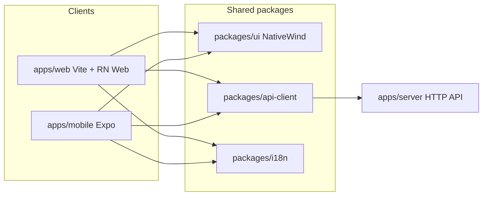

# React Native + NativeWind migration

Roadmap for shipping a **React Native (Expo)** client alongside the existing
**Vite web** app, with **shared UI components** styled via **NativeWind**
(Tailwind-compatible `className` on RN primitives).

Status: **mobile product shell largely complete** (Expo SDK 54 for current
Expo Go). Remaining: expand RN-Web Storybook stories / eventual web atom
import switch, push (needs spec delta), device matrix. Spec 014 covers native
sessions. Google + Apple → Bearer on `/login`. Brand fonts via expo-font.
`packages/ui` Storybook verifies PageTitle on RN Web (NativeWind + TW 3.4);
production Vite stays Tailwind v4.

---

## Goals

1. Keep **both** web and native clients forever, talking to the same
   `apps/server` HTTP API (`/api`, `/img`).
2. Share the **same component implementations** (not merely the same look).
3. Reuse Tailwind-era design tokens and utility-class habits via NativeWind.
4. Respect constitution / AGENTS boundaries: clients never import
   `packages/core` or concrete providers.

## Non-goals (this roadmap)

- Replacing the production web app with Expo Web.
- Big-bang rewrite of every screen before a first native slice ships.
- Changing zip round-trip, provider import rules, or core multi-tenancy.
- Store listing, EAS secrets, or App Store / Play Console setup (ops later).

---

## Why NativeWind (and what it is not)

**NativeWind** is “Tailwind for React Native.” It fits baykuş because
[`apps/web/src/index.css`](../apps/web/src/index.css) already centers on
`@theme` tokens (`void`, `snow`, `yellow`, DM Sans / DM Serif Display /
JetBrains Mono) and utility `className`s.

| NativeWind does | NativeWind does not |
|---|---|
| Keep `className="bg-void text-snow p-4"` on shared components | Make today’s DOM tree (`div`, portals, View Transitions CSS) run on iOS/Android |
| Map utilities to native `StyleSheet` (and CSS on web via RN Web) | Remove the need to rewrite UI onto RN primitives once |

Shared UI must be written (or rewritten) with:

```tsx
import { View, Text, Pressable, Image, ScrollView } from "react-native";
```

not HTML elements. Web consumes those same modules through **react-native-web**
aliases in the Vite app.

---

## Target architecture

| Layer | Choice |
|---|---|
| Mobile | Expo — `apps/mobile` |
| Styling | NativeWind + shared tokens from current `@theme` |
| Shared UI | `packages/ui` — RN primitives only |
| Web | Keep Vite SPA; alias `react-native` → `react-native-web` so web imports `@baykus/ui` |
| Data | `packages/api-client` + TanStack Query; HTTP only |
| i18n | `packages/i18n` — shared `tr` / `en` catalogs |
| Auth | Spec 014: cookie (web) + Bearer via `returnToken` (native) |
| Navigation | Web: TanStack Router (keep). Mobile: Expo Router. Screens take thin nav adapters |



### Import rules (amended when packages land)

| From | May import |
|---|---|
| `apps/web`, `apps/mobile` | `@baykus/ui`, `@baykus/api-client`, `@baykus/i18n` (and other **client** shared packages); **never** `packages/core`, providers, or importers |
| `packages/ui` | RN / NativeWind / icons; no server, no `core` |
| `packages/api-client` | `fetch` + shared DTO types only; no React Native / DOM APIs except behind adapters |
| `apps/server` | composition root (unchanged) |

Today AGENTS lists `apps/mobile` and the client packages in the Boundaries
table. Web already uses `@baykus/api-client` + `@baykus/i18n`; DOM UI remains
in `apps/web` until the RN Web strangler (Phase 4.7).

---

## Phase 0 — Constraints (repo truth)

Checklist before writing any mobile code:

- [x] Re-read constitution Articles I–III and VI; do not weaken zip round-trip tests.
- [x] Confirm dual session transport on server (already implemented):
  - Cookie preferred when both present.
  - Native: login/claim/oauth with `"returnToken": true` → store opaque token →
    send `Authorization: Bearer <token>`.
  - Bearer-only mutations skip `X-Baykus` (014 E118 / E119).
- [x] Treat 014 non-goal “RN / Expo scaffolding” as **superseded by this doc**.
- [x] List platform forks that must **not** be forced into `packages/ui`:

| Feature | Web today | Native approach |
|---|---|---|
| View Transitions / poster morph | `pageViewTransition`, `posterTransition`, CSS VT | Skip or replace with Reanimated / shared-element later |
| Push | Service Worker + `lib/push.ts` | Expo Notifications (may need server contract delta) |
| OAuth GIS / Apple JS | DOM script inject | Native Google / Apple SDKs → same `id_token` POST |
| Skip-link / `document.documentElement.lang` | DOM a11y | Native a11y props + i18n locale |
| `createPortal` modals | React DOM | RN `Modal` / bottom sheet |
| Absolute API URLs | Vite proxy `/api` | Configured `BAYKUS_API_BASE_URL` (or equivalent) |

---

## Phase 1 — Monorepo layout

- [x] Scaffold Expo app at `apps/mobile` (TypeScript blank template; Expo Router later).
- [x] Add packages:
  - `packages/ui` — scaffold export (`UI_PACKAGE`); NativeWind + components in Phase 3–4
  - `packages/api-client` — transport config stub; full `request()` in Phase 2
  - `packages/i18n` — locale constants stub; catalogs move in Phase 2
  - Optional: `packages/tokens` if theme should live outside `ui`; otherwise keep tokens inside `packages/ui`
- [x] Confirm [`pnpm-workspace.yaml`](../pnpm-workspace.yaml) already covers `apps/*` and `packages/*`.
- [x] Root script `dev:mobile` → `@baykus/mobile start`; packages have `typecheck`.
- [x] Update [`AGENTS.md`](../AGENTS.md) Boundaries table for `apps/mobile` + client packages.
- [x] Pin **Expo SDK** to **54** (store Expo Go, e.g. 54.0.2). NativeWind **4.2.x** +
  Tailwind **3.4.x** on mobile (web keeps Tailwind v4 Vite plugin).

Suggested tree:

```text
apps/
  web/                 # Vite SPA (production web)
  mobile/              # Expo (iOS / Android)
  server/              # unchanged composition root
packages/
  ui/                  # RN + NativeWind components
  api-client/
  i18n/
  core/                # unchanged — clients must not import
  provider-*/          # unchanged
```

---

## Phase 2 — Extract non-UI shared code first

Lowest risk; unblocks mobile without rewriting every atom.

### 2.1 `packages/api-client`

Move / re-export from:

- [`apps/web/src/api/client.ts`](../apps/web/src/api/client.ts) (thin configure + re-export)
- [`apps/web/src/api/types.ts`](../apps/web/src/api/types.ts) → `@baykus/api-client/types`
- [`apps/web/src/api/images.ts`](../apps/web/src/api/images.ts) (base URL aware)

Transport adapter:

| Concern | Web | Native |
|---|---|---|
| Base URL | relative `/api` (proxy) | absolute HTTPS origin (`EXPO_PUBLIC_API_BASE_URL`) |
| Credentials | `same-origin` cookie session | `omit` |
| Auth header | omit | `Authorization: Bearer …` via `getAccessToken` |
| CSRF | send `X-Baykus: 1` on cookie transport | omit when Bearer-only |
| Token obtain | N/A (cookie set by server) | `returnToken: true` on login / claim / oauth; persist once |

- [x] Web app switched to import `@baykus/api-client` with web adapter (`configureApiClient` + telemetry hooks).
- [x] Series path grammar shared (`series-path.ts`); unit tests green.
- [x] Document SecureStore key name and logout = delete session + clear store (auth screens).

### 2.2 `packages/i18n`

- [x] Move catalogs into `packages/i18n/locales/` (`tr.json` / `en.json`).
- [x] Web inits i18next from `@baykus/i18n` (keeps `document.documentElement.lang` sync).
- [x] Mobile i18next init (when screens need strings).
- [x] **Do not hand-edit `tr.json` / `en.json`** in ad-hoc agent edits — follow the repo’s existing i18n workflow / tooling when adding keys. Catalogs live under `packages/i18n/locales/`.

### 2.3 Pure helpers

Candidates to share (no DOM):

- [`apps/web/src/lib/date.ts`](../apps/web/src/lib/date.ts) (still web-local)
- [x] Series path helpers (`packages/api-client` `seriesParam` / `parseSeriesParam`)
- Any DTO mappers that are already pure

Leave DOM-tied modules in `apps/web` (`posterTransition`, `pageViewTransition`, `push`, scroll restoration, OAuth script inject).

---

## Phase 3 — NativeWind + design tokens

Pinned for mobile: **NativeWind 4.2.x** + **Tailwind CSS 3.4.x** (web stays on Tailwind v4
`@theme` in Vite). Shared hex values live in `packages/ui` tokens.

- [x] Port brand colors/fonts into shared tokens:
  - [`packages/ui/src/tokens.ts`](../packages/ui/src/tokens.ts) + [`tokens.cjs`](../packages/ui/tokens.cjs)
  - Mobile [`tailwind.config.js`](../apps/mobile/tailwind.config.js) extends `void` / `snow` / `muted` / `muted-dim` / `yellow` + font families
  - Web [`index.css`](../apps/web/src/index.css) `@theme` documents sync comment
- [x] Layout spacing constants in `tokens.space` (content/list/page insets) — utility wrappers later
- [x] Document **web-only** utilities (hover / VT / skip-link) — still in Phase 0 table; do not use in `packages/ui`
- [x] Font loading via `expo-font` + `@expo-google-fonts/{dm-sans,dm-serif-display,jetbrains-mono}`
  (family names match tokens; display registered as italic cut).
- [x] Smoke component [`BrandSmoke`](../packages/ui/src/BrandSmoke.tsx) with NativeWind `className` on mobile (`pnpm typecheck` green). RN Web Storybook (`pnpm --filter @baykus/ui storybook`) covers PageTitle; production Vite RN Web still deferred (see §4.7).

---

## Phase 4 — Shared UI migration (same components)

Port into `packages/ui` **bottom-up**. Web pages switch imports incrementally (strangler)
**after** Vite + `react-native-web` is wired; until then web keeps DOM atoms and mobile
consumes `@baykus/ui`.

### Definition of done (per component)

- [ ] Implemented with RN primitives + NativeWind `className`
- [ ] Renders on web via RN Web and on iOS/Android simulator
- [ ] Tokens match brand (void / snow / yellow / type)
- [ ] Tests updated (Vitest + RN Testing Library or equivalent)
- [ ] Story updated (web Storybook with RN Web, or RN Storybook)

### 4.1 Icons

- [x] Shared atoms use `lucide-react-native` (peer of `@baykus/ui`).
- [x] Ban raw `lucide-react` inside `packages/ui` (enforced by review; web still uses `lucide-react`).
  No `lucide-react` imports under `packages/ui` — only `lucide-react-native`.

### 4.2 Atoms (port first)

Current folders under [`apps/web/src/components/atoms/`](../apps/web/src/components/atoms/):

1. Accordion — pending (web height-transition; port with Reanimated later)  
2. [x] Checkbox → `packages/ui/src/atoms/Checkbox.tsx`  
3. [x] CircularProgress → `packages/ui/src/atoms/CircularProgress.tsx` (`react-native-svg`)  
4. [x] EpisodeLabel → `packages/ui/src/atoms/EpisodeLabel.tsx`  
5. [x] MediaImage → `packages/ui/src/atoms/MediaImage.tsx`  
6. [x] PageTitle → `packages/ui/src/atoms/PageTitle.tsx`  
7. [x] RatingControl → `packages/ui/src/atoms/RatingControl.tsx` (labels injected; no i18next in ui)  
8. [x] ReleaseTime → `packages/ui/src/atoms/ReleaseTime.tsx` (label + locale injected)  
9. [x] SectionPill → `packages/ui/src/atoms/SectionPill.tsx`  
10. [x] SegmentedButtonGroup → `packages/ui/src/atoms/SegmentedButtonGroup.tsx`  
11. [x] SegmentedProgress → `packages/ui/src/atoms/SegmentedProgress.tsx` + `lib/progressSegments.ts`  
12. [x] SettingsSelect → `packages/ui/src/atoms/SettingsSelect.tsx` (RN Modal sheet; web Modal molecule later)  
13. [x] Skeleton (`SkeletonBone` / `SkeletonPill`) → `packages/ui/src/atoms/Skeleton.tsx` (full page shells stay web-local for now)  
14. [x] StepperInput → `packages/ui/src/atoms/StepperInput.tsx`  
15. [x] Accordion → `packages/ui/src/atoms/Accordion.tsx` (LayoutAnimation; web height easing stays web)

`BrandSmoke` on mobile exercises most of the ported set. **Atoms complete.**

### 4.3 Molecules

Under [`apps/web/src/components/molecules/`](../apps/web/src/components/molecules/):

- [x] ConfirmDialog → `packages/ui/src/molecules/ConfirmDialog.tsx`
- [x] EmptyPanel → `packages/ui/src/molecules/EmptyPanel.tsx`
- [x] EpisodeTags → `packages/ui/src/molecules/EpisodeTags.tsx` (+ `lib/episodeTags.ts`)
- [x] Modal → `packages/ui/src/molecules/Modal.tsx` (bottom sheet; desktop popover stays web)
- [x] SeriesCard → `packages/ui/src/molecules/SeriesCard.tsx` (presentational; `onPress` + `posterUrl`)
- [x] CastRail, OAuthButtons (shell), PageTitleRow, PullToRefresh, SearchResultThumb,
  SectionHeader, SortMenu, CollapsedSeasonsGap, NextUpCard, WatchNextRow,
  CalendarEntryRow, AddSectionBar (up/down reorder; web drag stays web)
- [ ] (none critical) — further polish only

Notes:

- **Modal** — RN `Modal` sheet; no `createPortal`. Web desktop modal/popover stays in `apps/web`.
- **PullToRefresh** — native should prefer `RefreshControl`.
- **OAuthButtons** — shared layout; platform-specific press handlers from app shells.
- **SeriesCard / NextUpCard** — no router/query inside ui; apps inject navigation.

### 4.4 Organisms

Under [`apps/web/src/components/organisms/`](../apps/web/src/components/organisms/):

CategoryListSection, CategorySection, EpisodeRow, MonthGrid,
ProfileBannerPicker, ProfilePhotoUpload, ScheduleGrid, SeasonActionsMenu,
SeasonSection, SeriesActionsMenu, SeriesDetailsSheet.

- [x] EpisodeRow (compact) → `packages/ui/src/organisms/EpisodeRow.tsx` — enough for
  mark-watched vertical slice; menus / rating prompt / overview fetch still web.

High-effort native reimplementations (styling share ≠ behavior share):

- ScheduleGrid (observers / pan) — **native week×weekday matrix shipped**
  (`packages/ui` `ScheduleGrid` + `buildScheduleGridModel`; calendar schedule mode).
  Infinite bi-directional paging / strip-span absolute layout still thinner than web.
- MonthGrid
- Profile photo / banner pickers (ImagePicker) — **done on mobile** (`profile` avatar + banner modal)
- SeriesDetailsSheet / menus (native menus or custom sheets)

### 4.5 Dialogs

Under [`apps/web/src/components/dialogs/`](../apps/web/src/components/dialogs/):

DeleteAccountDialog, EpisodeDetailsModal, RemoveSeriesDialog, ResetLibraryDialog,
RestoreBackupDialog, TmdbKeyDialog, UnwatchSeasonDialog, WatchDateDialog.

### 4.6 Layout chrome

[`apps/web/src/components/layout/`](../apps/web/src/components/layout/) (AppHeader, tab bar, ProfileGuard):

- Extract **shared presentational** pieces where possible.
- Keep **navigation wiring** in each app (TanStack vs Expo Router).

### 4.7 Strangler order for web

1. [x] Point shared **pure helpers** at `@baykus/ui` subpaths (no RN runtime):
   web `lib/airing.ts` + `lib/categoryColors.ts` re-export from
   `@baykus/ui/lib/*`. Package exports: `lib/airing`, `lib/categoryColors`,
   `lib/progressSegments`, `tokens`, etc.
2. [x] Point one leaf **atom** at `@baykus/ui` via **dedicated RN Web Storybook**
   (`packages/ui` + `@storybook/react-native-web-vite` + NativeWind + Tailwind 3.4)
   — story: `atoms/PageTitle`. Production Vite web **stays on Tailwind v4** and
   keeps DOM atoms for now.
   <!-- DECISION: do not force NativeWind into apps/web Vite (TW v4). Verify
   shared RN atoms on Metro (mobile BrandSmoke) and packages/ui RN-Web
   Storybook (TW 3.4 + NativeWind). Expand web strangler imports only after a
   deliberate TW4/NativeWind pairing or when swapping an atom is style-safe. -->
3. Expand molecules → organisms → dialogs (web import switch after step 2 pairing).
4. Delete duplicate local components only when both clients import the package.
5. Do not leave web broken mid-PR — each PR should keep `pnpm test` / typecheck green.

---

## Phase 5 — App shells (platform-specific)

### 5.1 Expo Router map

Mirror [`apps/web/src/router.tsx`](../apps/web/src/router.tsx):

| Web path | Mobile route (suggested) |
|---|---|
| `/` | `index` |
| `/series/$id` | `series/[id]` |
| `/series/new` | `series/new` |
| `/watch` | `watch/index` |
| `/watch/history` | `watch/history` |
| `/calendar` | `calendar/index` |
| `/calendar/month` | `calendar/month` |
| `/calendar/schedule` | `calendar/schedule` |
| `/user/$handle` | `(tabs)/profile` (session handle) |
| `/user/$handle/all-series` | `library/all` |
| `/user/$handle/stats` | `profile/stats` (full Stats fields, list/row UI) |
| `/user/$handle/favorites` | `library/favorites` |
| `/search` | `search` |
| `/settings` | `(tabs)/settings` (hidden tab; linked from profile) |
| Library home | `(tabs)/index` + All series link |
| `/login` | `login` |
| `/claim` | `claim` |
| `/import` | `import` |
| `/stats` → redirect | same replace-redirect to profile stats |

- [x] Safe areas (`SafeAreaProvider`), system back, deep links scheme `baykus://`.
- [x] Auth gate equivalent for multi-mode library (redirect CTA → `/login`).
- [x] Expo Router tabs + stack: watch, library, calendar, search, profile; series,
  login, claim, import, library/all, watch history, brand smoke.

### 5.2 Auth (multi mode)

- [x] Google native path: `expo-auth-session` → `id_token` →
  `POST /api/auth/oauth/callback` with `returnToken: true` → SecureStore.
  First-time users get `needs_handle` → `oauth/claim` (same as web, 014 E114).
- [x] Apple native SDK (`expo-apple-authentication`) — same `id_token` (+ raw
  nonce) POST; iOS only; requires `usesAppleSignIn` + App ID capability.
- [x] Password path: POST login with `returnToken: true` → SecureStore
  (`baykus.accessToken`) → `Authorization: Bearer`.
- [ ] Append **iOS / Android** client IDs to `BAYKUS_GOOGLE_CLIENT_IDS` /
  `BAYKUS_APPLE_CLIENT_IDS` as **non-first** entries (014 E122: first ID is web,
  exposed to SPA; later IDs are accept-audiences only). Documented for ops in
  `apps/mobile/.env.example` + README — still a deploy-time checklist item.
- [x] Logout: `POST /api/auth/logout` with Bearer + clear SecureStore.

### 5.3 Push

- [x] Audit server push subscription contract (web push / VAPID vs device tokens).
  **Finding:** normative contracts (`001` §Push + `003` POST `/api/push/test`)
  are **Web Push only** — `PushSubscription` JSON (`endpoint`, `keys.p256dh` /
  `keys.auth`), VAPID public key, endpoint-keyed unsubscribe. No Expo /
  FCM / APNs device-token fields exist.
- [x] Native device push **requires a spec delta** before wiring Expo
  Notifications — do not invent subscription shapes silently.
  <!-- DECISION: hold Expo Notifications until a numbered spec amends
  contracts/api.md with an explicit native device-token (or dual) schema. -->
  Stub: [`docs/native-push.md`](./native-push.md).
- [ ] Wire Expo Notifications after the contract exists.

### 5.4 Media and uploads

- [x] Image URLs absolute against API host (`/img/...` via `buildImageUrl` +
  `EXPO_PUBLIC_API_BASE_URL`).
- [x] Zip / avatar uploads via Expo DocumentPicker / ImagePicker + `FormData` (same endpoints as web).

### 5.5 Streaming (refresh / TV Time import)

Web uses `fetch` + `ReadableStream` (not `EventSource`). On RN:

- [x] Prefer the same fetch-stream pattern if the runtime supports it.
  <!-- DECISION: mobile TV Time import/confirm reuse api-client SSE readers over fetch body streams (Hermes / Expo fetch). No poll fallback unless a device matrix finds a gap. -->
- [ ] Otherwise document a poll / progress-endpoint fallback and record it in the relevant spec with `<!-- DECISION: ... -->`.

---

## Phase 6 — Screens and product parity

### First vertical slice (ship early) — **done**

1. [x] Login / session restore (password + Google/Apple + SecureStore)
2. [x] Library list (sort + pull-to-refresh)
3. [x] Series detail (poster, cast, seasons/episodes)
4. [x] Mark episode watched / unwatched

Then expand calendar, watch hub, profile/stats, import, settings polish, search.

### Screen checklist

- [x] Library (flat grid + sort + link to category All series)
- [x] All series (`/library/all` — CATEGORY_ORDER sections + per-section sort via AddSectionBar)
- [x] Series detail (preview `/series/new` + add; accordion seasons + next-up)
- [x] Watch (category sections + quick-mark + uiPrefs section manage/sort) + watch history (newest/oldest)
- [x] Calendar timeline / month grid / schedule week×weekday grid
- [x] Profile hub (banner picker, avatar, stats tiles, favorites + all-series previews)
- [x] Favorites (`/library/favorites`) + All series (`/library/all`)
- [x] Stats full payload (`/profile/stats` — all Stats fields; activity as intensity strip)
- [x] Search (results, preview, quick-add)
- [x] Settings (`(tabs)/settings` — general + providers + account + danger; no native push)
- [x] Import + export zip; TV Time match/confirm with SSE progress
- [x] Login + claim (`returnToken` + SecureStore; optional seed zip on claim)

Remaining thinner vs web (not blockers for birebir API surface): schedule infinite
paging / strip-span layout polish; native push (blocked — needs contract).

### Platform polish matrix

| Concern | Web-only OK | Native-native |
|---|---|---|
| Poster View Transitions | yes | omit initially |
| Desktop header / wide layout | yes | phone/tablet nav patterns |
| Pull-to-refresh | custom or shared | `RefreshControl` |
| System back / gestures | history stack | React Navigation / Expo defaults |
| File drag-drop import | yes | picker only |

---

## Phase 7 — Quality gates

- [x] CI: root `pnpm typecheck` / `pnpm test` / `pnpm lint` already recurse
  workspace packages (`@baykus/ui`, `@baykus/api-client`, `@baykus/i18n`,
  `@baykus/mobile` typecheck scripts included). No separate mobile job needed
  until a device/EAS smoke gate is added.
- [ ] Lint: keep Biome for TS packages; follow Expo’s required tooling only where Metro demands it — do not add ESLint/Prettier to the whole monorepo.
- [ ] Manual device matrix: iOS + Android for auth, Bearer session persistence, library mutate, zip import, OAuth link.
- [x] Storybook: web DOM Storybook remains; shared RN atoms use
  `packages/ui` RN-Web Storybook (`pnpm --filter @baykus/ui storybook`, port 6007)
  covering atoms, key molecules (EmptyPanel, ConfirmDialog, SeriesCard,
  EpisodeTags, SectionHeader, PageTitleRow, OAuthButtons, NextUpCard,
  WatchNextRow), EpisodeRow, and BrandSmoke gallery.
- [x] Update AGENTS reading map when client packages become normative.
- [ ] Never weaken zip round-trip or provider boundaries to green CI.

---

## Phase 8 — Cutover and coexistence

- [ ] Both clients remain first-class against one API.
- [ ] No freeze on web features during migration — new UI should land in `packages/ui` when feasible, or web-local with a follow-up port task.
- [ ] Mobile can ship the vertical slice before full parity.
- [ ] Expo Web may be used for **UI debugging**; production web stays Vite + RN Web aliases.
- [ ] When mobile is real, update root README / HANDOVER “what’s next” accordingly.

---

## Suggested milestone order (summary)

| Milestone | Outcome |
|---|---|
| M-RN0 | This doc accepted; constraints listed |
| M-RN1 | `apps/mobile` + empty `packages/ui` / `api-client` / `i18n` scaffold; CI wires (**done**) |
| M-RN2 | Shared api-client + i18n; web on adapters; SecureStore Bearer (**done**) |
| M-RN3 | Tokens + NativeWind smoke + brand fonts (**done**); production Vite RN Web deferred |
| M-RN4 | Atoms/molecules on mobile (**done**); RN-Web Storybook PageTitle (**done**); web DOM strangler open |
| M-RN5 | Core screens on mobile (**done**) |
| M-RN6 | Add-from-search, calendar modes, locale/export, TV Time SSE, avatar (**done**) |
| M-RN7 | Native OAuth (Google + Apple) + push stub (**OAuth done**; push blocked on spec) |
| M-RN8 | Device matrix + more molecule stories + docs polish |

Exact task IDs can later live in a formal `specs/0xx-react-native/` if product work is scheduled; until then this file is the checklist.

---

## Caveats

1. **NativeWind is not a config flip** — expect a UI-layer rewrite onto RN primitives, then shared forever.
2. **Pin NativeWind + Tailwind versions** at scaffold; Tailwind v4 on web today
   pairs with a **separate** NativeWind/TW 3.4 pipeline (mobile Metro +
   `packages/ui` RN-Web Storybook) — do not merge into production Vite without
   an explicit follow-up.
3. **Complex layouts** (ScheduleGrid, sheets, heatmap pan, section reorder) need native behavior work even when colors/spacing are shared.
4. **`apps/web` remains the product web app** — do not dual-ship a second production Expo web.
5. **Silent API divergence is forbidden** — any native-only endpoint or push schema belongs in a spec delta in the same change set.

---

## References

- Constitution: [`.specify/memory/constitution.md`](../.specify/memory/constitution.md)
- Agent instructions / boundaries: [`AGENTS.md`](../AGENTS.md)
- Auth / Bearer (normative): [`specs/014-oauth-signin/spec.md`](../specs/014-oauth-signin/spec.md), [`contracts/api.md`](../specs/014-oauth-signin/contracts/api.md)
- Web routes: [`apps/web/src/router.tsx`](../apps/web/src/router.tsx)
- Web tokens: [`apps/web/src/index.css`](../apps/web/src/index.css)
- Web API client: [`apps/web/src/api/client.ts`](../apps/web/src/api/client.ts)
- Self-hosting / env (client IDs): [`docs/self-hosting.md`](./self-hosting.md)
